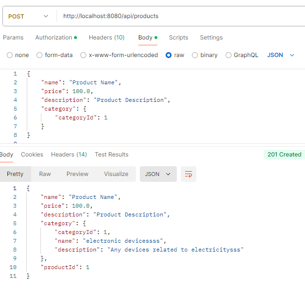
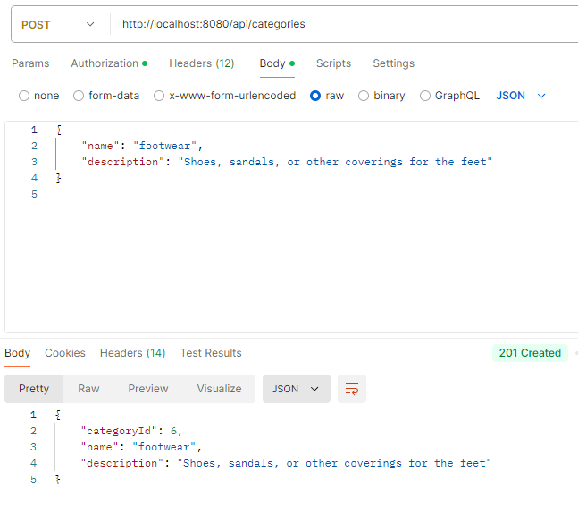

Write some CRUD APIs with Spring Boot

Steps to test your APIs:
Create User Account (No ADMIN Authentication Needed):
You can create a user account without needing ADMIN authentication.

Generate JWT Token:
This is the URL for generating your JWT token for authentication.

Create Admin Account (Requires JWT Token):
When creating an account for an admin, you must provide a valid JWT token in the request header.

Perform Other Actions (ADMIN Authentication Required):
Most of the API actions (GET, UPDATE, DELETE) require ADMIN authentication. Make sure to include the JWT token in the request headers for these operations.

